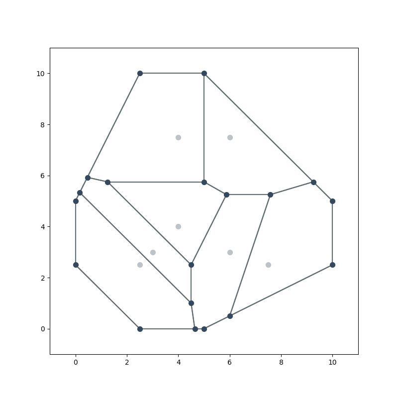

Quick start
===========

Basic example
-------------
This is a basic example that quickly constructs and visualizes a voronoi graph.

.. code-block:: python

   from foronoi import Voronoi, Polygon, Visualizer, Point, VoronoiObserver
   from foronoi.graph import HalfEdge, Vertex

   # Define some points (a.k.a sites or cell points)
   points = [
       (2.5, 2.5), (4, 7.5), (7.5, 2.5), (6, 7.5), (4, 4), (3, 3), (6, 3)
   ]

   # Define a bounding box / polygon
   polygon = Polygon([
       (2.5, 10), (5, 10), (10, 5), (10, 2.5), (5, 0), (2.5, 0), (0, 2.5), (0, 5)
   ])

   # Initialize the algorithm
   v = Voronoi(polygon)

   # Optional: visualize the voronoi diagram at every step.
   # You can find more information in the observers.py example file
   # v.attach_observer(
   #     VoronoiObserver()
   # )

   # Create the Voronoi diagram
   v.create_diagram(points=points)

   # Visualize the Voronoi diagram
   Visualizer(v) \
       .plot_sites(show_labels=False) \
       .plot_edges(show_labels=False) \
       .plot_vertices() \
       .show()

Result:

Properties
----------

Below are some examples of how to retrieve certain components and properties from the voronoi graph and what
kind of operations are possible.

.. code-block:: python

   from typing import List

   # Some examples of how to access properties from the Voronoi diagram:
   edges: List[HalfEdge] = v.edges                    # A list of all edges
   vertices: List[Vertex] = v.vertices                # A list of all vertices
   sites: List[Point] = v.sites                       # A list of all cell points (a.k.a. sites)

   edge, vertex, site = edges[0], vertices[0], sites[0]

   # Edge operations
   origin: Vertex = edge.origin               # The vertex in which the edge originates
   target: Vertex = edge.twin.origin          # The twin is the edge that goes in the other direction
   target_alt: Vertex = edge.target           # Same as above, but more convenient
   twin: HalfEdge = edge.twin                 # Get the twin of this edge
   next_edge: HalfEdge = edge.next            # Get the next edge
   prev_edge: HalfEdge = edge.twin.next       # Get the previous edge
   prev_alt: HalfEdge = edge.prev             # Same as above, but more convenient

   # Site operations
   size: float = site.area()                  # The area of the cell
   borders: List[HalfEdge] = site.borders()   # A list of all the borders that surround this cell point
   vertices: List[Vertex] = site.vertices()   # A list of all the vertices around this cell point
   site_x: float = site.x                     # X-coordinate of the site
   site_xy: [float, float] = site.xy          # (x, y)-coordinates of the site
   first_edge: HalfEdge = site.first_edge     # Points to the first edge that is part of the border around the site

   # Vertex operations
   connected_edges: List[HalfEdge] = vertex.connected_edges  # A list of all edges that are connected to this vertex
   vertex_x: float = vertex.x                                # x-coordinate of the vertex
   vertex_xy: [float, float] = vertex.xy                     # (x, y)-coordinates of the vertex

Observers
---------

Observers allow you to observe the state of the algorithm and visualize components during the construction of the
voronoi graph. Below you can see an example where we attach an observer that visualizes the voronoi graph at every
step (event).

.. code-block:: python

   import os

   from foronoi import Polygon, Voronoi, VoronoiObserver
   from foronoi.visualization import Presets

   # Define some points (a.k.a sites or cell points)
   points = [
       (2.5, 2.5), (4, 7.5), (7.5, 2.5), (6, 7.5), (4, 4), (3, 3), (6, 3)
   ]

   # Define a bounding box / polygon
   polygon = Polygon([
       (2.5, 10), (5, 10), (10, 5), (10, 2.5), (5, 0), (2.5, 0), (0, 2.5), (0, 5)
   ])

   # Initialize the algorithm
   v = Voronoi(polygon)

   # Attach a Voronoi observer that visualizes the Voronoi diagram every step
   v.attach_observer(
       VoronoiObserver(

           # Settings to pass into the visualizer's plot_all() method.
           # - By default, the observer uses a set of minimalistic presets
           #   that are useful for visualizing during construction, clipping
           #   and the final result.
           # - The settings below will update the default presets used by the
           #   observer. For example, by default, the arc_labels are not shown,
           #   but below we can enable the arc labels. Other parameters can be
           #   found in the visualizer's plot_all() method.
           settings=dict(arc_labels=True, site_labels=True),

           # Callback that saves the figure every step
           # If no callback is provided, it will simply display the figure in
           # a matplotlib window
           callback=lambda observer, figure: figure.savefig(
               f"output/voronoi/{observer.n_messages:02d}.png"
           ),

           visualize_steps=True            # Default = True
           visualize_before_clipping=True  # Default = False
           visualize_result=True           # Default = True
       )
   )

   # Create the output directory if it doesn't exist
   if not os.path.exists("output"):
       os.mkdir("output")

   if not os.path.exists("output/voronoi/"):
       os.mkdir("output/voronoi/")

   # Create the Voronoi diagram
   v.create_diagram(points=points)

Slideshow of images in `output/voronoi/`:

.. image:: ../attachments/animation.gif
  :width: 800
  :alt: Voronoi diagram construction animation
